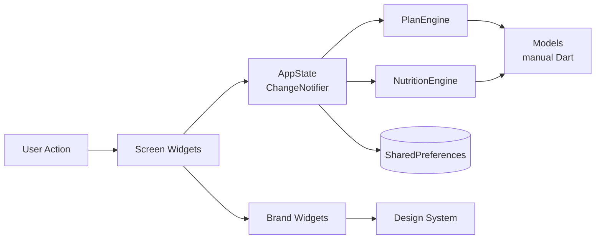

<div align="center">

# 💪 FitForge

**智能健身 App · AI-Powered Personal Trainer**

基于用户画像自动生成训练和营养计划的 Flutter 跨平台健身应用。
A Flutter cross-platform fitness app that auto-generates personalized workout and nutrition plans.

[](https://github.com/JassonG-xt/Fit_Forge/actions/workflows/ci.yml)
[](https://codecov.io/gh/JassonG-xt/Fit_Forge)
[](https://github.com/JassonG-xt/Fit_Forge/releases/latest)
[](LICENSE)
[](https://flutter.dev)

**[📱 Download APK](https://github.com/JassonG-xt/Fit_Forge/releases/latest)** · **[🌐 Try Web Demo](https://JassonG-xt.github.io/Fit_Forge/)** · **[📚 Docs](docs/README.md)** · **[🔒 Privacy](docs/privacy.md)** · **[🐛 Report Bug](https://github.com/JassonG-xt/Fit_Forge/issues/new?template=bug_report.md)**

</div>

---

> FitForge 是一个**完全免费、离线优先、开源**的健身训练助手。你输入一次身体数据和目标，它为你生成一套完整的 7 天训练计划和营养方案——不需要订阅、不需要联网、不需要把数据交给云端。

> **安全提示**：FitForge 只提供通用健身与营养辅助，不构成医疗建议。受伤、患病、怀孕、饮食障碍或有其他健康风险的用户，应先咨询专业人士。

## ✨ 亮点 / Highlights

- 🎯 **智能计划生成** — 根据周频率（1-6 次）、目标（增肌/减脂/维持/耐力）、经验级、可用器材**自动生成** 7 天训练计划（full body / push-pull-legs / upper-lower）
- 🍎 **营养计算引擎** — BMR → TDEE → 目标热量，三大宏量 + 每日水摄入，附食物建议
- 📈 **进度追踪** — streak 连续天数、总训练次数、PR（个人最佳）、身体数据趋势图
- 🏆 **成就系统** — 5 种成就类型（连续/总量/PR/部位掌握/营养）
- 💾 **离线优先** — 完全本地持久化（`SharedPreferences`），支持 JSON 导入导出
- 🎨 **自研设计系统** — 品牌色 + 排版 + 5 个自定义组件（HeroCard / StatNumber / HeatStrip / GlowButton / ProgressRing）
- 🔄 **崩溃恢复** — 训练中途 app 被杀死也能恢复现场
- 🌓 **深浅双主题**；🌏 **中英双语 i18n** 规划中
- 📱 **跨平台基础** — Android（alpha APK）+ Web（browser demo）；iOS 工程骨架已生成，但尚未正式发布

## 📱 截图 / Screenshots

当前仓库暂未内置静态截图资源，避免 README 长期挂着过期画面。要看真实界面，直接打开上方 Web Demo，或按下方命令本地运行。

## 🚀 Quick Start

### 📥 下载使用 / Install

| Platform | How |
|----------|-----|
| 🤖 **Android** | [Download latest APK](https://github.com/JassonG-xt/Fit_Forge/releases/latest) → 开启"未知来源"→ 安装 |
| 🌐 **Web** | [Open in browser](https://JassonG-xt.github.io/Fit_Forge/) — no install needed |
| 🍎 **iOS** | Not yet — see [Roadmap](#-roadmap) |

> **Web Demo 提示**：首次打开需 2–5 秒下载 Flutter engine，期间会看到品牌加载动画——这是 Flutter Web 的已知冷启动特性，后续访问会进浏览器缓存秒开。数据完全保存在浏览器 `localStorage`，清缓存会丢失；建议长期使用装 Android APK。

### 🛠 本地开发 / Local Development

```bash
# Prerequisites: Flutter 3.11.4+, Android SDK or Chrome
git clone https://github.com/JassonG-xt/Fit_Forge.git
cd Fit_Forge
flutter pub get
flutter run                    # 默认设备
flutter run -d chrome          # 浏览器
flutter test                   # 跑测试
```

#### 🌐 Web 预览 / Web Preview

本地用 `python -m http.server` 预览 `build/web` 时，默认是**站点根路径**，所以应访问 `http://localhost:8000/`，不要访问 `http://localhost:8000/Fit_Forge/`。

```bash
flutter build web --release
cd build/web
python -m http.server 8000
```

如果你要在本地**模拟 GitHub Pages** 的发布路径 `https://JassonG-xt.github.io/Fit_Forge/`，需要同时满足两件事：

1. 构建时指定 `--base-href /Fit_Forge/`
2. 静态服务器目录里真的存在 `Fit_Forge/` 子目录

```bash
flutter build web --release --base-href /Fit_Forge/
mkdir -p preview/Fit_Forge
cp -r build/web/* preview/Fit_Forge/
cd preview
python -m http.server 8000
```

然后访问 `http://localhost:8000/Fit_Forge/`。

See [CONTRIBUTING.md](CONTRIBUTING.md) for detailed setup.

## 🏗 技术栈 / Tech Stack

| Layer | Technology |
|-------|-----------|
| Framework | [Flutter 3.11+](https://flutter.dev) / Dart |
| State | [Provider](https://pub.dev/packages/provider) + `ChangeNotifier` |
| Persistence | [SharedPreferences](https://pub.dev/packages/shared_preferences) (JSON) |
| Charts | [fl_chart](https://pub.dev/packages/fl_chart) |
| Typography | [google_fonts](https://pub.dev/packages/google_fonts) |
| Models | Hand-written Dart models; `freezed` + `json_serializable` planned |
| i18n | Planned; current UI is primarily Chinese |
| Testing | `flutter_test` unit + widget tests |
| CI/CD | GitHub Actions (Linux runner) |
| Crash Reporting | Planned: [Sentry](https://sentry.io) |
| Health Data | Planned: [health](https://pub.dev/packages/health) / Android Health Connect |

## 📐 架构 / Architecture



- **AppState** is the in-memory source of truth; `AppStateStore` owns local persistence
- **Engines** are pure, testable functions — no Flutter dependency
- **Screens** read state via `Consumer<AppState>` and dispatch actions via methods

See [docs/architecture.md](docs/architecture.md) for a repo-grounded overview of state, persistence, screens, and data flow.

## 🗂 目录结构 / Project Structure

```
lib/
├── main.dart                   # Entry + Provider injection
├── engines/
│   ├── plan_engine.dart        # Auto-generate weekly workout plans
│   └── nutrition_engine.dart   # BMR/TDEE + macros + meal plan
├── models/                     # Hand-written Dart models
│   ├── enums.dart
│   ├── user_profile.dart
│   ├── exercise.dart
│   ├── food.dart
│   ├── workout_plan.dart
│   ├── workout_session.dart
│   ├── body_metric.dart
│   ├── achievement.dart
│   └── models.dart             # Barrel export
├── services/
│   ├── app_state.dart          # Global state + crash recovery coordination
│   ├── app_state_store.dart    # SharedPreferences persistence boundary
│   └── session_queries.dart    # Pure session-derived query helpers
├── screens/                    # 14 screens
│   ├── onboarding/
│   ├── home/
│   ├── main_tab_screen.dart
│   ├── library/
│   ├── plan/
│   ├── workout/
│   ├── progress/
│   ├── nutrition/
│   ├── settings/
│   └── more/
├── widgets/
│   ├── brand/                  # 5 custom brand components
│   └── cards/
└── theme/                      # Design system

test/
├── engines/                    # Unit: plan + nutrition engine
├── services/                   # Unit: app_state behavior
└── screens/                    # Widget tests
```

Localization ARB files are planned and are not yet checked into the repository.

## 🧪 测试 / Testing

Current automated test coverage spans:

| Layer | Scope | Tools |
|-------|-------|-------|
| Unit | Business logic, models, and state transitions | `flutter_test` |
| Widget | Core navigation and selected primary screens | `flutter_test` + `SharedPreferences` mock |
| Planned | Golden visual regression + E2E happy path | `golden_toolkit`, `integration_test` |

```bash
flutter test                              # All non-integration tests
flutter test --coverage                   # With coverage
```

Current checked coverage is **70%+** on this branch. Run `flutter test --coverage` on the current `HEAD` to see the exact number for your revision.

## 🗺 Roadmap

### ✅ Current implemented baseline
- Android alpha APK release on GitHub Releases
- Web Demo on GitHub Pages
- Core engines + 14 screens + design system
- Local JSON persistence, import/export, workout recovery
- Unit/widget tests with strict analyzer settings
- GitHub Actions workflows for CI, release, and web deploy

### 🚧 Near-term planned work
- i18n (zh / en)
- Local notifications
- Android Health Connect (read weight)
- Sentry crash reporting
- Full UI i18n coverage (currently core screens only)
- PDF report export (leverages existing `exportToJson`)
- Expanded Health Connect scope (heart rate, steps)

### 🔮 v2 (Future — requires macOS)
- iOS support
- Apple HealthKit integration
- Scheduled push notifications (server-side)
- Cloud sync (optional, encrypted)
- Play Store / App Store release

## 📚 Documentation

Current project documentation lives in:

- [docs/README.md](docs/README.md) — docs index
- [docs/architecture.md](docs/architecture.md) — runtime architecture and module boundaries
- [docs/testing.md](docs/testing.md) — test commands, scope, and current gaps
- [docs/release.md](docs/release.md) — versioning, Android release tags, and web deploy flow
- [CONTRIBUTING.md](CONTRIBUTING.md) — development workflow, lint, tests, PR process
- [CHANGELOG.md](CHANGELOG.md) — release history and planned work
- `.github/workflows/` — CI, release, and web deploy automation

## 🤝 Contributing

Contributions welcome! See [CONTRIBUTING.md](CONTRIBUTING.md) for:
- Development setup
- Commit / PR conventions
- Test requirements

## 📄 License

[MIT](LICENSE) © gxt

## 🙏 Acknowledgments

- Exercise library seed data in [`assets/data/exercise_library.json`](assets/data/exercise_library.json)
- Food database seed in [`assets/data/food_database.json`](assets/data/food_database.json)
- Design inspiration from modern fitness apps (Strong, Hevy, MacroFactor)

---

<div align="center">

**If this project helps you, please consider giving it a ⭐ to support the work!**

</div>
