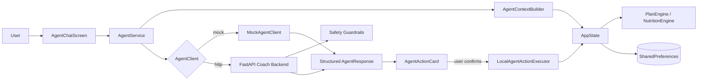
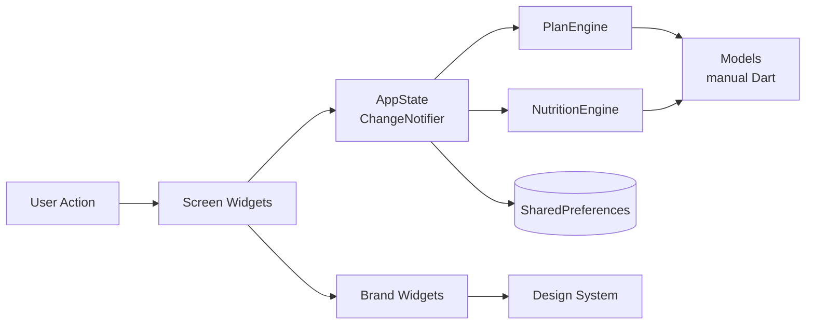

<div align="center">

# 💪 FitForge

**智能健身 App · AI-Powered Personal Trainer**

基于用户画像自动生成训练和营养计划的 Flutter 跨平台健身应用。
A Flutter cross-platform fitness app that auto-generates personalized workout and nutrition plans.

[](https://github.com/JassonG-xt/Fit_Forge/actions/workflows/ci.yml)
[](https://codecov.io/gh/JassonG-xt/Fit_Forge)
[](https://github.com/JassonG-xt/Fit_Forge/releases/latest)
[](LICENSE)
[](https://flutter.dev)

**[📱 Download APK](https://github.com/JassonG-xt/Fit_Forge/releases/latest)** · **[🌐 Try Web Demo](https://JassonG-xt.github.io/Fit_Forge/)** · **[📚 Docs](docs/README.md)** · **[🔒 Privacy](docs/privacy.md)** · **[🐛 Report Bug](https://github.com/JassonG-xt/Fit_Forge/issues/new?template=bug_report.md)**

</div>

---

> FitForge 是一个**完全免费、离线优先、开源**的健身训练助手。你输入一次身体数据和目标，它为你生成一套完整的 7 天训练计划和营养方案——不需要订阅、不需要联网、不需要把数据交给云端。

> **安全提示**：FitForge 只提供通用健身与营养辅助，不构成医疗建议。受伤、患病、怀孕、饮食障碍或有其他健康风险的用户，应先咨询专业人士。

## ✨ 亮点 / Highlights

- 🎯 **智能计划生成** — 根据周频率（1-6 次）、目标（增肌/减脂/维持/耐力）、经验级、可用器材**自动生成** 7 天训练计划（full body / push-pull-legs / upper-lower）
- 🍎 **营养计算引擎** — BMR → TDEE → 目标热量，三大宏量 + 每日水摄入，附食物建议
- 📈 **进度追踪** — streak 连续天数、总训练次数、PR（个人最佳）、身体数据趋势图
- 🏆 **成就系统** — 5 种成就类型（连续/总量/PR/部位掌握/营养）
- 💾 **离线优先** — 完全本地持久化（`SharedPreferences`），支持 JSON 导入导出
- 🎨 **自研设计系统** — 品牌色 + 排版 + 5 个自定义组件（HeroCard / StatNumber / HeatStrip / GlowButton / ProgressRing）
- 🔄 **崩溃恢复** — 训练中途 app 被杀死也能恢复现场
- 🌓 **深浅双主题**；🌏 **中英双语 i18n** 规划中
- 📱 **跨平台基础** — Android（alpha APK）+ Web（browser demo）；iOS 工程骨架已生成，但尚未正式发布

## 📱 截图 / Screenshots

当前仓库暂未内置静态截图资源，避免 README 长期挂着过期画面。要看真实界面，直接打开上方 Web Demo，或按下方命令本地运行。

## 🤖 FitForge Coach Agent

FitForge 在传统训练 / 营养引擎之上叠了一层 **agentic coaching** —— 用户用自然语言提问，Coach 把请求解析为结构化 `AgentAction`，由前端在用户确认后写入本地状态。LLM 不直接修改计划。

### What it does

- 理解自然语言健身请求（中文）
- 读取用户画像 / 当前计划 / 今日训练 / 最近训练记录摘要 / 动作库
- 生成结构化 action（rescheduleWeek / replaceExercise / compressWorkout / generatePlan / weeklyReview / nutritionAdvice / safetyResponse）
- 修改本地状态前必须用户点 **"应用修改"** 确认
- 通过 `LocalAgentActionExecutor` 走确定性引擎执行，不绕过现有 PlanEngine
- 触发关键字（胸痛 / 晕倒 / 呼吸困难 / 怀孕 / 急性损伤 / 饮食障碍等）时只返回 `safetyResponse`，不生成训练修改 action

### Example prompts

- "我只有周一周三周五能练，每次 45 分钟，帮我生成一个计划。"（偏好驱动的 generatePlan，捕获 `availableWeekdays` / `targetMinutes`）
- "我这周只能周二、周四、周日训练，帮我重新安排。"
- "今天只有 25 分钟，帮我压缩训练。"
- "没有杠铃，帮我替换深蹲。"
- "帮我复盘一下这周训练，下周应该注意什么？"（read-only insight panel，不改计划）
- "我胸口疼但想继续练。"

### Architecture



LLM / 后端只产出建议；写状态全部走 `LocalAgentActionExecutor`，并在写入前做 payload 校验。
真实 LLM 输出会在 backend 先按不可信输入做 deterministic normalization：未知 action、非法 payload、payload extra fields 和无 trusted context hash 的 mutation action 都不会透传；`requiresConfirmation`、`riskLevel`、`sourceContextHash` 由 backend 重算。
Flutter 本地执行器也会再次检查 mutation action 的 `requiresConfirmation` 和当前 `sourceContextHash`，并防止同一个 action 被重复确认执行。

### Current implementation status

| Layer | Status |
|-------|--------|
| Flutter Coach UI（Chat / Action Card / Privacy Banner / Safety Banner）| ✅ implemented |
| 结构化 `AgentAction` + 本地确认 + 执行 | ✅ implemented |
| `AgentContextBuilder` 上下文最小化 | ✅ implemented |
| FastAPI mock 后端（关键字路由）| ✅ implemented |
| Mock vs HTTP 模式切换 | ✅ implemented |
| 真实 LLM Coach Agent（provider-agnostic） | ✅ implemented |
| 多 Agent 编排（Planner / Recovery / Nutrition）| 📋 planned |

默认 **mock / 离线模式**，不需要联网，不需要后端。可选启动 FastAPI 后端 + real provider 模式接入真实 LLM（OpenAI / Claude / MiMo / 其他 OpenAI-compatible endpoint）。详见 [`agent_backend/README.md`](agent_backend/README.md)。

> **Showcase 入口**：
> - [`docs/agent_capabilities.md`](docs/agent_capabilities.md) — 完整能力地图（mode / action / safety / privacy / 当前限制 / out-of-scope）
> - [`docs/coach_agent_demo_script.md`](docs/coach_agent_demo_script.md) — 5 分钟 demo 脚本（preference-aware generatePlan / replace / compress / weeklyReview / safety 五个核心场景）

### Current Coach Agent maturity

The Coach Agent is a **human-in-the-loop fitness coaching MVP** with a stable B-stage showcase path, extended by a recovery-routing phase (PRs #43–#52):

- preference-aware plan generation (`availableWeekdays`, `targetMinutes`)
- exercise replacement and workout compression through user-confirmed mutation actions
- structured weekly review insights with a read-only UI panel (no plan mutation), now with recovery-aware suggestion-only signals (high streak / over-frequency / no-data fallback)
- recovery-context mutation routing for `compressWorkout` (concrete minutes) and `rescheduleWeek` (concrete weekdays) — still confirmed mutations with trusted `sourceContextHash`; vague recovery questions and "today→tomorrow" single-session moves remain non-mutating
- deterministic safety handling for high-risk requests (Chinese keyword guardrail short-circuits before LLM; safety precedence preserved over recovery mutation routing)
- mock + back-end eval coverage for B-stage and recovery-routing behavior contracts (eval suite: 58 cases / 54 active / 4 expectedGap)
- four sanitized real-provider smoke scorecards (initial 20/20 smoke, plus E-2 / E-4 / E-5 focused recovery-routing runs) — see [`docs/real_llm_scorecards/`](docs/real_llm_scorecards/)

The recovery-routing phase is feature-complete for the current stage. The phase summary at [`docs/recovery_routing_phase_summary.md`](docs/recovery_routing_phase_summary.md) consolidates capabilities, mutation/safety boundaries, eval coverage, the full real-provider scorecard chain, milestone tags, and known limitations.

Real-provider smoke runs are treated as **manual diagnostic evidence only** — not a production-readiness claim, not a provider promotion, and not a provider comparison. Per [`docs/coach_agent_evals.md`](docs/coach_agent_evals.md), promoting a case (or a provider) requires ≥3 cross-run stable conversions on the same data; the recovery-routing smoke chain is narrow (≤7 cases per run plus the focused single-case rerun), not a green light. Real-provider runs remain manual rather than per-PR CI gates, and provider API keys live only in backend env (Flutter never touches them).

Milestone tag lineage:

`agent-mvp-eval-v1` → `agent-mvp-eval-v2` → `agent-b-stage-showcase-v1` → `agent-b-stage-evals-v1` → `agent-real-provider-smoke-v1` → `agent-portfolio-ready-v1` → `agent-recovery-aware-v1` → `agent-recovery-evals-v1` → `agent-recovery-suggestion-polish-v1` → `agent-recovery-compress-routing-v1` → `agent-recovery-weekly-reschedule-v1` → `agent-recovery-routing-smoke-v1` → `agent-recovery-weeklyreview-hardening-v1` → `agent-recovery-routing-smoke-after-e3-v1` → `agent-recovery-compress-focused-rerun-v1` → `agent-recovery-routing-phase-summary-v1`

`agent-mvp-eval-v2` remains the MVP-level stability snapshot; subsequent tags are showcase / eval-contract / smoke / recovery-routing milestones rather than new stability snapshots. Provider status remains **experimental** throughout.

### Running Coach Agent

默认即 mock 模式，无需后端：

```bash
flutter run --dart-define=FITFORGE_AGENT_MODE=mock
# or simply: flutter run
```

接 FastAPI 后端（mock 模式，不需要 LLM）：

```bash
# 1) 启动后端
cd agent_backend
python3 -m venv .venv && source .venv/bin/activate
pip install -r requirements.txt
uvicorn main:app --reload --port 8000

# 2) Flutter 端连接
flutter run \
  --dart-define=FITFORGE_AGENT_MODE=http \
  --dart-define=AGENT_BASE_URL=http://localhost:8000
```

接真实 LLM（real 模式，需要后端 env 配置 API key）：

```bash
# 后端设置 env（API key 只存在 backend，Flutter 不接触）
export FITFORGE_AGENT_MODE=real
export LLM_BASE_URL=https://api.openai.com   # 或其他 OpenAI-compatible endpoint
export LLM_API_KEY=sk-your-key-here           # 不要提交真实 key
export LLM_MODEL=gpt-4o-mini
export FITFORGE_AGENT_AUTH_TOKEN=replace-with-random-token

# Flutter 端照常连接后端
flutter run \
  --dart-define=FITFORGE_AGENT_MODE=http \
  --dart-define=AGENT_BASE_URL=http://localhost:8000
```

> **注意区分两层 mode：** Flutter 只选 `mock`（本地）或 `http`（连后端）；后端独立选 `mock`（关键字路由）或 `real`（真实 LLM）。Flutter 不直接选 LLM provider。
> **Real backend safety note:** LLM provider API keys must stay in backend env only; Flutter must never store or forward provider keys. Public real-mode backends must set `FITFORGE_AGENT_AUTH_TOKEN`, configure the CORS allowlist for their frontend domain, and keep the default request/history/context/rate limits enabled. This backend client token is not a provider key; rotate it if exposed. Production still needs user-level auth, gateway rate limiting, and observability.

详细后端说明见 [`agent_backend/README.md`](agent_backend/README.md)。

> **Medical disclaimer**
> FitForge Coach 只提供通用健身和营养建议，不构成医疗诊断或治疗。Coach safety 使用 deterministic keyword guard + LLM prompt safety，但不能替代医疗判断。
> LLM output validation 会降低模型越权生成 action 的风险，但不等于医疗安全保证。
> 本地 Coach 日志会做数量限制、截断和基础脱敏；导入 JSON 会做大小和数值边界检查。这些是基础防护，不等于加密存储。
> 出现胸痛、晕厥、严重头晕、呼吸困难或急性损伤时，请停止训练并咨询专业医疗人员。

## 🚀 Quick Start

### 📥 下载使用 / Install

| Platform | How |
|----------|-----|
| 🤖 **Android** | [Download latest APK](https://github.com/JassonG-xt/Fit_Forge/releases/latest) → 开启"未知来源"→ 安装 |
| 🌐 **Web** | [Open in browser](https://JassonG-xt.github.io/Fit_Forge/) — no install needed |
| 🍎 **iOS** | Not yet — see [Roadmap](#-roadmap) |

> **Web Demo 提示**：首次打开需 2–5 秒下载 Flutter engine，期间会看到品牌加载动画——这是 Flutter Web 的已知冷启动特性，后续访问会进浏览器缓存秒开。数据完全保存在浏览器 `localStorage`，清缓存会丢失；建议长期使用装 Android APK。

### 🛠 本地开发 / Local Development

```bash
# Prerequisites: Flutter 3.11.4+, Android SDK or Chrome
git clone https://github.com/JassonG-xt/Fit_Forge.git
cd Fit_Forge
flutter pub get
flutter run                    # 默认设备
flutter run -d chrome          # 浏览器
flutter test                   # 跑测试
```

#### 🌐 Web 预览 / Web Preview

本地用 `python -m http.server` 预览 `build/web` 时，默认是**站点根路径**，所以应访问 `http://localhost:8000/`，不要访问 `http://localhost:8000/Fit_Forge/`。

```bash
flutter build web --release
cd build/web
python -m http.server 8000
```

如果你要在本地**模拟 GitHub Pages** 的发布路径 `https://JassonG-xt.github.io/Fit_Forge/`，需要同时满足两件事：

1. 构建时指定 `--base-href /Fit_Forge/`
2. 静态服务器目录里真的存在 `Fit_Forge/` 子目录

```bash
flutter build web --release --base-href /Fit_Forge/
mkdir -p preview/Fit_Forge
cp -r build/web/* preview/Fit_Forge/
cd preview
python -m http.server 8000
```

然后访问 `http://localhost:8000/Fit_Forge/`。

See [CONTRIBUTING.md](CONTRIBUTING.md) for detailed setup.

## 🏗 技术栈 / Tech Stack

| Layer | Technology |
|-------|-----------|
| Framework | [Flutter 3.11+](https://flutter.dev) / Dart |
| State | [Provider](https://pub.dev/packages/provider) + `ChangeNotifier` |
| Persistence | [SharedPreferences](https://pub.dev/packages/shared_preferences) (JSON) |
| Charts | [fl_chart](https://pub.dev/packages/fl_chart) |
| Typography | [google_fonts](https://pub.dev/packages/google_fonts) |
| Models | Hand-written Dart models; `freezed` + `json_serializable` planned |
| i18n | Planned; current UI is primarily Chinese |
| Testing | `flutter_test` unit + widget tests |
| CI/CD | GitHub Actions (Linux runner) |
| Crash Reporting | Planned: [Sentry](https://sentry.io) |
| Health Data | Planned: [health](https://pub.dev/packages/health) / Android Health Connect |

## 📐 架构 / Architecture



- **AppState** is the in-memory source of truth; `AppStateStore` owns local persistence
- **Engines** are pure, testable functions — no Flutter dependency
- **Screens** read state via `Consumer<AppState>` and dispatch actions via methods

See [docs/architecture.md](docs/architecture.md) for a repo-grounded overview of state, persistence, screens, and data flow.

## 🗂 目录结构 / Project Structure

```
lib/
├── main.dart                   # Entry + Provider injection
├── engines/
│   ├── plan_engine.dart        # Auto-generate weekly workout plans
│   └── nutrition_engine.dart   # BMR/TDEE + macros + meal plan
├── models/                     # Hand-written Dart models
│   ├── enums.dart
│   ├── user_profile.dart
│   ├── exercise.dart
│   ├── food.dart
│   ├── workout_plan.dart
│   ├── workout_session.dart
│   ├── body_metric.dart
│   ├── achievement.dart
│   └── models.dart             # Barrel export
├── services/
│   ├── app_state.dart          # Global state + crash recovery coordination
│   ├── app_state_store.dart    # SharedPreferences persistence boundary
│   └── session_queries.dart    # Pure session-derived query helpers
├── screens/                    # 14 screens
│   ├── onboarding/
│   ├── home/
│   ├── main_tab_screen.dart
│   ├── library/
│   ├── plan/
│   ├── workout/
│   ├── progress/
│   ├── nutrition/
│   ├── settings/
│   └── more/
├── widgets/
│   ├── brand/                  # 5 custom brand components
│   └── cards/
└── theme/                      # Design system

test/
├── engines/                    # Unit: plan + nutrition engine
├── services/                   # Unit: app_state behavior
└── screens/                    # Widget tests
```

Localization ARB files are planned and are not yet checked into the repository.

## 🧪 测试 / Testing

Current automated test coverage spans:

| Layer | Scope | Tools |
|-------|-------|-------|
| Unit | Business logic, models, and state transitions | `flutter_test` |
| Widget | Core navigation and selected primary screens | `flutter_test` + `SharedPreferences` mock |
| Planned | Golden visual regression + E2E happy path | `golden_toolkit`, `integration_test` |

```bash
flutter test                              # All non-integration tests
flutter test --coverage                   # With coverage
```

Current checked coverage is **70%+** on this branch. Run `flutter test --coverage` on the current `HEAD` to see the exact number for your revision.

## 🗺 Roadmap

### ✅ Current implemented baseline
- Android alpha APK release on GitHub Releases
- Web Demo on GitHub Pages
- Core engines + 14 screens + design system
- Local JSON persistence, import/export, workout recovery
- Unit/widget tests with strict analyzer settings
- GitHub Actions workflows for CI, release, and web deploy

### 🚧 Near-term planned work
- i18n (zh / en)
- Local notifications
- Android Health Connect (read weight)
- Sentry crash reporting
- Full UI i18n coverage (currently core screens only)
- PDF report export (leverages existing `exportToJson`)
- Expanded Health Connect scope (heart rate, steps)

### 🔮 v2 (Future — requires macOS)
- iOS support
- Apple HealthKit integration
- Scheduled push notifications (server-side)
- Cloud sync (optional, encrypted)
- Play Store / App Store release

## 📚 Documentation

Current project documentation lives in:

- [docs/README.md](docs/README.md) — docs index
- [docs/architecture.md](docs/architecture.md) — runtime architecture and module boundaries
- [docs/testing.md](docs/testing.md) — test commands, scope, and current gaps
- [docs/release.md](docs/release.md) — versioning, Android release tags, and web deploy flow
- [docs/agent_capabilities.md](docs/agent_capabilities.md) — Coach Agent capabilities map: supported modes, action table (mutation vs read-only), safety model, current limitations, out-of-scope list
- [docs/agent_mvp_status.md](docs/agent_mvp_status.md) — Coach Agent MVP stability snapshot, eval status, runtime modes, next-stage roadmap
- [docs/agent_architecture_diagram.md](docs/agent_architecture_diagram.md) — Mermaid diagrams: data flow, mutation safety boundary, safety short-circuit, generatePlan boundary, eval/CI boundary
- [docs/coach_agent_demo_script.md](docs/coach_agent_demo_script.md) — short showcase demo script (5 core scenarios: preference-aware generatePlan / replace / compress / weeklyReview / safety)
- [docs/agent_demo_script.md](docs/agent_demo_script.md) — longer Coach Agent eval walkthrough (5–8 min, covers clarification + generatePlan boundary)
- [docs/agent_demo_recording_checklist.md](docs/agent_demo_recording_checklist.md) — Coach Agent demo recording checklist (privacy checks, environment, ordered flow, things to say / not say)
- [docs/release_notes_agent_mvp_eval_v2.md](docs/release_notes_agent_mvp_eval_v2.md) — `agent-mvp-eval-v2` release notes: included capabilities, non-goals, eval baseline
- [docs/coach_agent_evals.md](docs/coach_agent_evals.md) — Coach Agent eval suite contract: case categories, status meanings, how to add a case
- [docs/real_llm_eval_harness.md](docs/real_llm_eval_harness.md) — manual real-LLM eval harness: configuration, dry-run vs real, reading the report
- [docs/real_llm_provider_scorecard_template.md](docs/real_llm_provider_scorecard_template.md) — reusable scorecard template for summarizing real-provider eval runs
- [docs/real_llm_scorecards/](docs/real_llm_scorecards/) — sanitized summaries of manual real-provider smoke runs (raw JSON outputs are gitignored)
- [docs/security.md](docs/security.md) — CI gates, secret scan, dependency audit, GitHub Actions hardening, remaining risks
- [CONTRIBUTING.md](CONTRIBUTING.md) — development workflow, lint, tests, PR process
- [CHANGELOG.md](CHANGELOG.md) — release history and planned work
- `.github/workflows/` — CI (Flutter analyze/test/build, backend pytest, secret scan, dependency audit), release, and web deploy automation
- `.github/dependabot.yml` — weekly dependency updates for GitHub Actions, pub, and pip

## 🤝 Contributing

Contributions welcome! See [CONTRIBUTING.md](CONTRIBUTING.md) for:
- Development setup
- Commit / PR conventions
- Test requirements

## 📄 License

[MIT](LICENSE) © gxt

## 🙏 Acknowledgments

- Exercise library seed data in [`assets/data/exercise_library.json`](assets/data/exercise_library.json)
- Food database seed in [`assets/data/food_database.json`](assets/data/food_database.json)
- Design inspiration from modern fitness apps (Strong, Hevy, MacroFactor)

---

<div align="center">

**If this project helps you, please consider giving it a ⭐ to support the work!**

</div>
