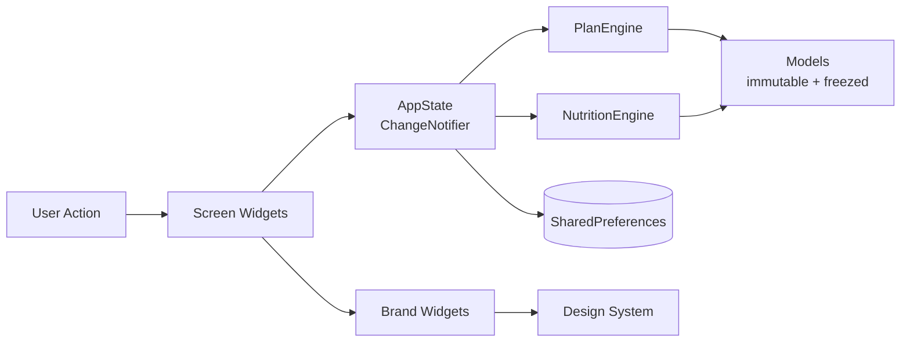

<div align="center">

# 💪 FitForge

**智能健身 App · AI-Powered Personal Trainer**

基于用户画像自动生成训练和营养计划的 Flutter 跨平台健身应用。
A Flutter cross-platform fitness app that auto-generates personalized workout and nutrition plans.

[](https://github.com/JassonG-xt/Fit_Forge/actions/workflows/ci.yml)
[](https://codecov.io/gh/JassonG-xt/Fit_Forge)
[](https://github.com/JassonG-xt/Fit_Forge/releases/latest)
[](LICENSE)
[](https://flutter.dev)

**[📱 Download APK](https://github.com/JassonG-xt/Fit_Forge/releases/latest)** · **[🌐 Try Web Demo](https://JassonG-xt.github.io/Fit_Forge/)** · **[📚 Docs](docs/)** · **[🐛 Report Bug](https://github.com/JassonG-xt/Fit_Forge/issues/new?template=bug_report.md)**

</div>

---

<!--
┌─────────────────────────────────────────────────────────────────┐
│  TODO (皇上亲自写)：pitch 段落 (5-8 行)                          │
│  参考角度：                                                      │
│  - 传统健身 app 的痛点（订阅制、计划模板化、离线不可用）          │
│  - FitForge 的差异化（开源 / 自动生成 / 离线优先 / 跨平台）       │
│  - 目标用户画像（健身爱好者、自律训练者、想摆脱付费 app 的人）    │
│  写好后删除这段注释                                              │
└─────────────────────────────────────────────────────────────────┘
-->

> FitForge 是一个**完全免费、离线优先、开源**的健身训练助手。你输入一次身体数据和目标，它为你生成一套完整的 7 天训练计划和营养方案——不需要订阅、不需要联网、不需要把数据交给云端。

## ✨ 亮点 / Highlights

- 🎯 **智能计划生成** — 根据周频率（1-6 次）、目标（增肌/减脂/维持/耐力）、经验级、可用器材**自动生成** 7 天训练计划（full body / push-pull-legs / upper-lower）
- 🍎 **营养计算引擎** — BMR → TDEE → 目标热量，三大宏量 + 每日水摄入，附食物建议
- 📈 **进度追踪** — streak 连续天数、总训练次数、PR（个人最佳）、身体数据趋势图
- 🏆 **成就系统** — 5 种成就类型（连续/总量/PR/部位掌握/营养）
- 💾 **离线优先** — 完全本地持久化（`SharedPreferences`），支持 JSON 导入导出
- 🎨 **自研设计系统** — 品牌色 + 排版 + 5 个自定义组件（HeroCard / StatNumber / HeatStrip / GlowButton / ProgressRing）
- 🔄 **崩溃恢复** — 训练中途 app 被杀死也能恢复现场
- 🌓 **深浅双主题** + 🌏 **中英双语 i18n**
- 📱 **跨平台** — Android（v1.0 release）+ Web（browser demo）+ iOS（v2 roadmap）

## 📱 截图 / Screenshots

<!-- TODO (Sprint 1.1 完成后补)：加 3-4 张实机截图到 docs/assets/ -->

<table>
  <tr>
    <td align="center"><b>Onboarding</b></td>
    <td align="center"><b>Home</b></td>
    <td align="center"><b>Workout</b></td>
    <td align="center"><b>Progress</b></td>
  </tr>
  <tr>
    <td></td>
    <td></td>
    <td></td>
    <td></td>
  </tr>
</table>

## 🚀 Quick Start

### 📥 下载使用 / Install

| Platform | How |
|----------|-----|
| 🤖 **Android** | [Download latest APK](https://github.com/JassonG-xt/Fit_Forge/releases/latest) → 开启"未知来源"→ 安装 |
| 🌐 **Web** | [Open in browser](https://JassonG-xt.github.io/Fit_Forge/) — no install needed |
| 🍎 **iOS** | Not yet — see [Roadmap](#-roadmap) |

### 🛠 本地开发 / Local Development

```bash
# Prerequisites: Flutter 3.11.4+, Android SDK or Chrome
git clone https://github.com/JassonG-xt/Fit_Forge.git
cd Fit_Forge
flutter pub get
flutter run                    # 默认设备
flutter run -d chrome          # 浏览器
flutter test                   # 跑测试
```

See [CONTRIBUTING.md](CONTRIBUTING.md) for detailed setup.

## 🏗 技术栈 / Tech Stack

| Layer | Technology |
|-------|-----------|
| Framework | [Flutter 3.11+](https://flutter.dev) / Dart |
| State | [Provider](https://pub.dev/packages/provider) + `ChangeNotifier` |
| Persistence | [SharedPreferences](https://pub.dev/packages/shared_preferences) (JSON) |
| Charts | [fl_chart](https://pub.dev/packages/fl_chart) |
| Animations | [Lottie](https://pub.dev/packages/lottie) |
| Typography | [google_fonts](https://pub.dev/packages/google_fonts) |
| Models | [freezed](https://pub.dev/packages/freezed) + [json_serializable](https://pub.dev/packages/json_serializable) (Sprint 2) |
| i18n | `flutter_localizations` + [intl](https://pub.dev/packages/intl) |
| Testing | `flutter_test` + [golden_toolkit](https://pub.dev/packages/golden_toolkit) + `integration_test` |
| CI/CD | GitHub Actions (Linux runner) |
| Crash Reporting | [Sentry](https://sentry.io) |
| Health Data | [health](https://pub.dev/packages/health) (Android Health Connect) |

## 📐 架构 / Architecture



- **AppState** is the single source of truth — one `ChangeNotifier` persisted through debounced writes
- **Engines** are pure, testable functions — no Flutter dependency
- **Screens** read state via `Consumer<AppState>` and dispatch actions via methods

Full architecture at [`docs/architecture.md`](docs/architecture.md).

## 🗂 目录结构 / Project Structure

```
lib/
├── main.dart                   # Entry + Provider injection
├── engines/
│   ├── plan_engine.dart        # Auto-generate weekly workout plans
│   └── nutrition_engine.dart   # BMR/TDEE + macros + meal plan
├── models/                     # Immutable data (freezed-backed)
│   ├── enums.dart
│   ├── user_profile.dart
│   ├── exercise.dart
│   ├── food.dart
│   ├── workout_plan.dart
│   ├── workout_session.dart
│   ├── body_metric.dart
│   ├── achievement.dart
│   └── models.dart             # Barrel export
├── services/
│   ├── app_state.dart          # Global state + persistence + crash recovery
│   ├── notification_service.dart  # Local notifications (Sprint 3)
│   └── health_service.dart     # Health Connect integration (Sprint 3)
├── screens/                    # 14 screens
│   ├── onboarding/
│   ├── home/
│   ├── main_tab_screen.dart
│   ├── library/
│   ├── plan/
│   ├── workout/
│   ├── progress/
│   ├── nutrition/
│   ├── settings/
│   └── more/
├── widgets/
│   ├── brand/                  # 5 custom brand components
│   └── cards/
├── theme/                      # Design system
└── l10n/                       # ARB localization files (Sprint 3)

test/
├── engines/                    # Unit: plan + nutrition engine
├── services/                   # Unit: app_state behavior
├── screens/                    # Widget tests
└── widgets/                    # Golden tests

integration_test/               # E2E tests
docs/                           # Architecture + guides
```

## 🧪 测试 / Testing

Testing pyramid (see [`docs/testing.md`](docs/testing.md)):

| Layer | Purpose | Tools |
|-------|---------|-------|
| Unit (~70%) | Business logic — engines, state mutations | `flutter_test` |
| Widget (~20%) | Screen rendering & interactions | `flutter_test` + `SharedPreferences` mock |
| Golden (~5%) | Visual regression on brand widgets | `golden_toolkit` |
| Integration (~5%) | E2E happy path | `integration_test` |

```bash
flutter test                              # All non-integration tests
flutter test --coverage                   # With coverage (target ≥ 70%)
flutter test --tags golden                # Golden visual regression
flutter test integration_test/ -d chrome  # E2E on web
```

## 🗺 Roadmap

### ✅ v1.0 (Current Goal)
- Android APK release on GitHub Releases
- Web Demo on GitHub Pages
- Core engines + 14 screens + design system
- 70%+ test coverage
- i18n (zh / en)
- Local notifications
- Android Health Connect (read weight)
- Sentry crash reporting
- Full CI/CD pipeline

### 🚧 v1.1 (Planned)
- Full UI i18n coverage (currently core screens only)
- PDF report export (leverages existing `exportToJson`)
- More lottie animations
- Expanded Health Connect scope (heart rate, steps)

### 🔮 v2 (Future — requires macOS)
- iOS support
- Apple HealthKit integration
- Scheduled push notifications (server-side)
- Cloud sync (optional, encrypted)
- Play Store / App Store release

## 📚 Documentation

Deep-dives on the codebase under [`docs/`](docs/):

- [Architecture Overview](docs/architecture.md) — layers, data flow, module responsibilities
- [State Management](docs/state-management.md) — why Provider, debounce strategy, caches
- [Engines](docs/engines.md) — PlanEngine split logic, NutritionEngine formulas
- [Testing Strategy](docs/testing.md) — pyramid layers, patterns, tooling
- [Release Guide](docs/release.md) — tag → CI → signed APK → Sentry DSN

## 🤝 Contributing

Contributions welcome! See [CONTRIBUTING.md](CONTRIBUTING.md) for:
- Development setup
- Commit / PR conventions
- Test requirements

## 📄 License

[MIT](LICENSE) © gxt

## 🙏 Acknowledgments

- Exercise library seed data in [`assets/data/exercise_library.json`](assets/data/exercise_library.json)
- Food database seed in [`assets/data/food_database.json`](assets/data/food_database.json)
- Lottie animations from [lottiefiles.com](https://lottiefiles.com) (see individual file credits)
- Design inspiration from modern fitness apps (Strong, Hevy, MacroFactor)

---

<div align="center">

**If this project helps you, please consider giving it a ⭐ to support the work!**

</div>
