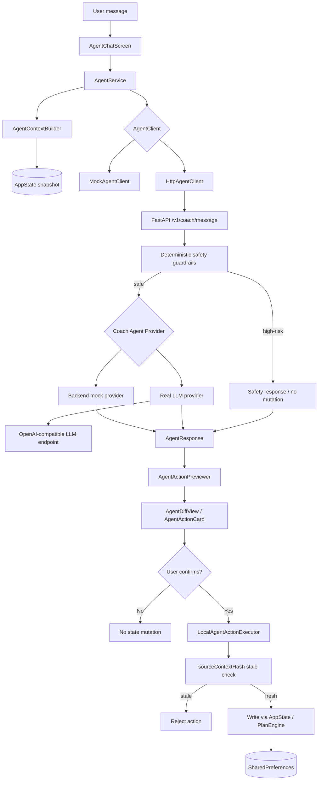
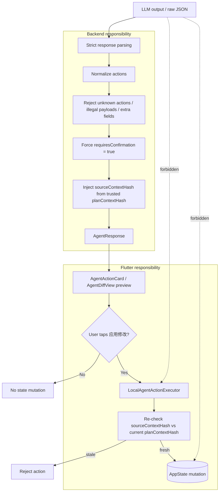
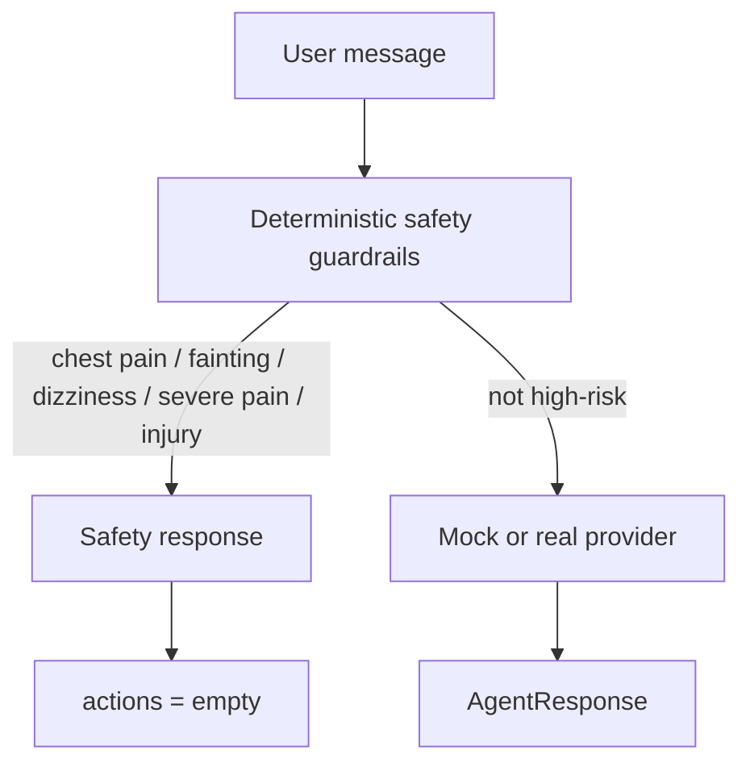
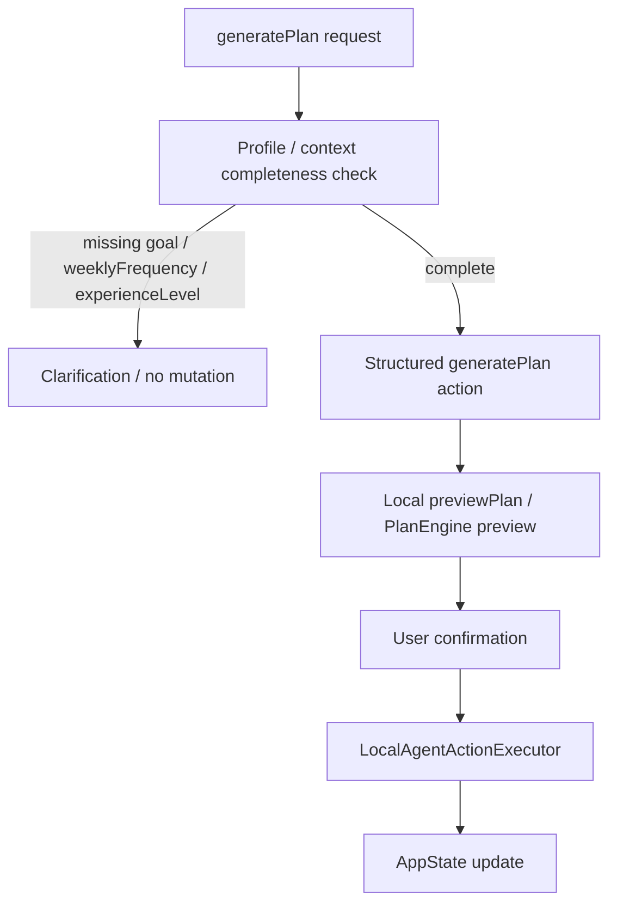
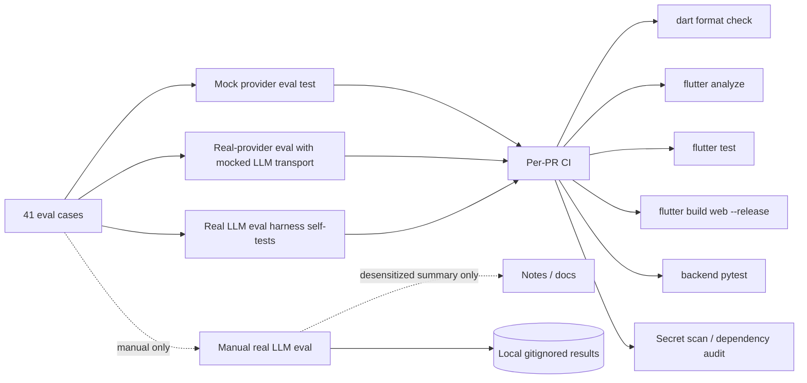

# FitForge Coach Agent Architecture Diagram

## 目标

本文用图说明 FitForge Coach Agent MVP eval v2 的核心边界：

- LLM 是 router，不是 state writer
- 用户确认前不写 AppState
- `LocalAgentActionExecutor` 是唯一写入口
- `sourceContextHash` 用于 stale action protection
- safety guardrails 优先于 mutation
- generatePlan 不由 LLM 直接生成完整 plan
- real LLM eval 不进 per-PR CI
- Flutter 不保存 LLM API key

当前 baseline：`agent-mvp-eval-v2`，eval suite `41 total / 37 active / 4 expectedGap`。

如果代码与本文档不一致，以 `lib/`、`test/`、`agent_backend/`、`.github/workflows/` 为准。

---

## High-level architecture

### 说明

- 用户自然语言输入从 `AgentChatScreen` 进入。
- Flutter 侧通过 `AgentService` 和 `AgentContextBuilder` 组装 trusted context。
- Agent client 可以走 `MockAgentClient`，也可以走 `HttpAgentClient → FastAPI backend`。
- backend 先走 deterministic safety guardrails，再决定是否进入 provider。
- provider 返回 `AgentResponse` 后，Flutter 只做 preview，不直接写状态。
- 用户确认后，才由 `LocalAgentActionExecutor` 通过现有 `AppState` / `PlanEngine` 写入状态。

---

## Mutation safety boundary

下图把 mutation action 的处理拆成 **Backend** 和 **Flutter** 两条 swimlane，并显式标出 LLM **不能**直接到达的目标。

### Backend 责任

- `agent_backend/agents/output_validation.py` — strict response parsing，未知 action / 非法 payload / extra fields 直接丢弃
- `agent_backend/agents/action_safety.py::inject_action_safety` — 强制 `requiresConfirmation=true`，并用 trusted `planContextHash` 覆盖 LLM 自带的 `sourceContextHash`
- `agent_backend/agents/coach_agent.py` / `llm_provider.py` — 在返回 `AgentResponse` 前调用上述两步
- `agent_backend/safety/fitness_guardrails.py` — deterministic safety guardrails 在调用 LLM 之前命中关键字时直接返回 safety response，不进入 LLM

### Flutter 责任

- `lib/agent/action_preview.dart` — `AgentActionPreviewer` 计算 before/after 预览
- `lib/screens/agent/agent_diff_view.dart` / `agent_action_card.dart` — UI 上展示 preview，要求用户显式点击「应用修改」
- `lib/agent/local_agent_action_executor.dart` — 唯一写入 `AppState` 的入口；执行前再次比对 `sourceContextHash` 与当前 `planContextHash`，stale 一律拒绝；并且拒绝 `requiresConfirmation=false` 或缺少 hash 的 mutation
- `lib/services/app_state.dart` — 通过现有 `AppState` / `PlanEngine` 改写状态，不暴露任何「跳过 executor」的入口

### LLM 不能做什么

- 不能直接调用 `LocalAgentActionExecutor`
- 不能直接写 `AppState`
- LLM 自己输出的 `sourceContextHash` 不可信；真正用于 stale protection 的 hash 必须来自 trusted server context
- 不能通过 prompt injection 让 backend 跳过 parsing / normalization / confirmation / hash 注入

---

## Safety short-circuit

### 说明

- 高风险 safety 请求**不依赖** LLM 判断。
- 这类请求会在 provider 调用前被 deterministic guardrails 短路（mock 和 real 路径都一样）。
- 返回的是 safety response，而不是 mutation action。
- 普通疲劳、酸痛、轻微不适，不应误判为 high-risk safety；详细 keyword 列表见 `agent_backend/safety/fitness_guardrails.py`。

---

## generatePlan boundary

### 说明

- LLM 不自由生成完整 weekly workout plan。
- LLM 只负责识别 intent，并返回 structured `generatePlan` action（payload 当前固定为 `{"usePreviewPlan": true}`）。
- 真正的计划生成由本地 `previewPlan` / `PlanEngine` 完成。
- 如果 profile / context 不完整（缺 `goal` / `weeklyFrequency` / `experienceLevel`），backend guard 直接 strip 掉 action，返回 clarification。
- 只有 context 足够、用户确认后，才会进入 `LocalAgentActionExecutor` 写入 `AppState`。
- 详细产品边界见 `docs/generate_plan_agent_boundary.md`。

---

## Eval and CI boundary

### 说明

- per-PR CI **不**调用真实 LLM，**不**需要任何 LLM key。
- CI 跑的是：
  - mock provider eval（确定性 router）
  - real-provider eval **with mocked LLM transport**（验证 backend normalization / safety injection / parser，不联网）
  - real LLM eval harness 的 **self-tests**（用 mocked transport 测试 harness 代码本身）
- **真实 LLM eval 只做手动运行**：
  - 用 `agent_backend/evals/run_real_llm_eval.py` 在 OpenAI-compatible / MiMo / Claude 等 provider 上跑
  - 原始结果保留在本地 gitignored 路径（`agent_backend/evals/results/*.json` / `*.md`），**不**进入 git
  - 如需进入 git，只能是脱敏后的 summary（每类别通过/失败计数 + 升级候选清单）
- CI 同时保证：format / analyze / Flutter tests / web build / backend pytest / secret scan / dependency audit。

---

## 当前 baseline

- Tag: `agent-mvp-eval-v2`
- Main commit: `1fc443e`
- Eval baseline: `41 total / 37 active / 4 expectedGap`
- 剩余 4 个 expectedGap (`compress_short_no_minutes_zh_004` / `replace_pullup_alternative_zh_005` / `replace_too_hard_zh_006` / `reschedule_only_two_days_zh_005`) 保留为 regression signal，不追求强行全绿。

---

## 核心结论

FitForge Coach Agent 的目标不是「让 LLM 控制 App」。

真正的设计目标是：

> 一个安全、可审计、可评估、用户确认式的 agentic coaching layer。

因此必须始终满足：

- LLM 是 router，不是 state writer
- 用户确认是 mutation 的前置条件
- `LocalAgentActionExecutor` 是唯一写入口
- `sourceContextHash` 防 stale，trusted hash 来自 server，不是 LLM
- safety guardrails 先于 mutation
- generatePlan 不由 LLM 直接生成完整 plan
- 真实 LLM eval 不进 per-PR CI
- Flutter 不保存 LLM API key

## 相关文档

- `docs/agent_mvp_status.md` — Coach Agent MVP stability snapshot 与 next-stage roadmap
- `docs/coach_agent_evals.md` — eval suite contract
- `docs/generate_plan_agent_boundary.md` — generatePlan 产品边界
- `docs/agent_demo_script.md` — 5–8 分钟 demo 脚本
- `docs/release_notes_agent_mvp_eval_v2.md` — `agent-mvp-eval-v2` release notes
- `docs/real_llm_eval_harness.md` — real LLM eval harness 跑法
- `docs/agent_real_mode_smoke_test.md` — backend real 模式 manual smoke test
