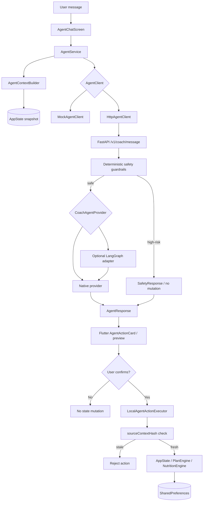
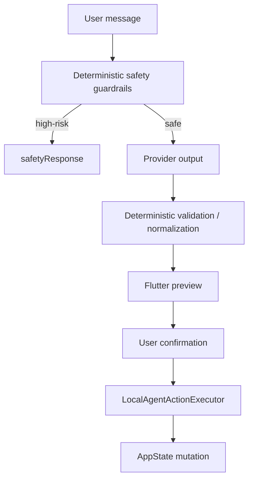
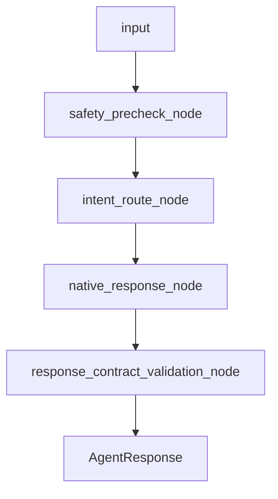

# FitForge Coach Agent Architecture Diagram

## Goal

FitForge Coach Agent is a provider-agnostic structured-action layer.
The backend can use the native provider or the optional experimental
LangGraph orchestrator, but every path returns the same structured
contract and still routes mutations through deterministic validation and
user confirmation.

## High-level architecture

## Safety boundary

## What this means

- The provider layer is not the authority for mutation.
- LLM output is always untrusted.
- `sourceContextHash` is injected from trusted backend context.
- `requiresConfirmation` is forced for mutation actions.
- Safety short-circuits happen before provider execution.
- LangGraph, when enabled, is only an orchestration wrapper.

## LangGraph node flow

The optional graph still delegates actual action generation to the native
provider. It only adds explicit deterministic node boundaries around the
existing contract.

## Current non-goals

- no direct LLM state mutation
- no multi-agent autonomy
- no streaming
- no long-term memory
- no cloud sync
- no UI redesign

## Related docs

- `docs/agent_orchestration_adapter.md`
- `docs/coach_agent_evals.md`
- `docs/coach_agent_demo_script.md`
- `docs/agent_mvp_status.md`
